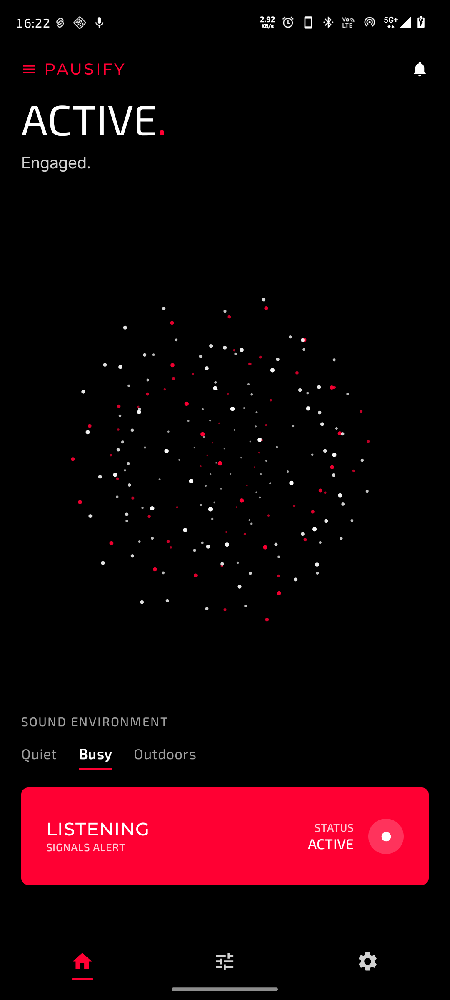
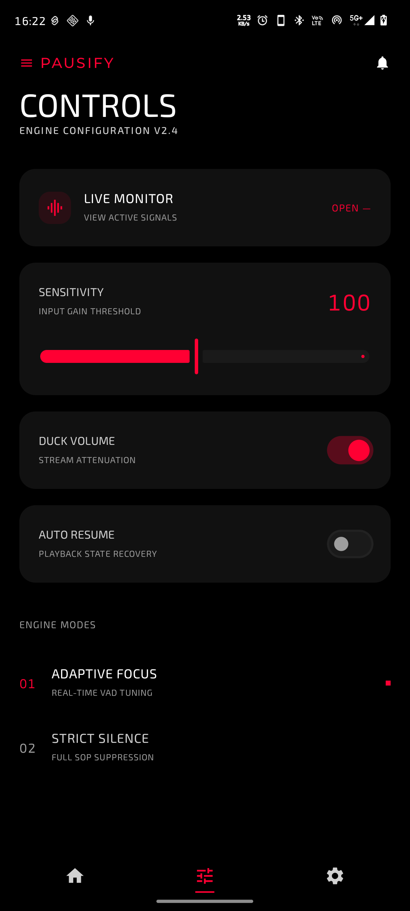
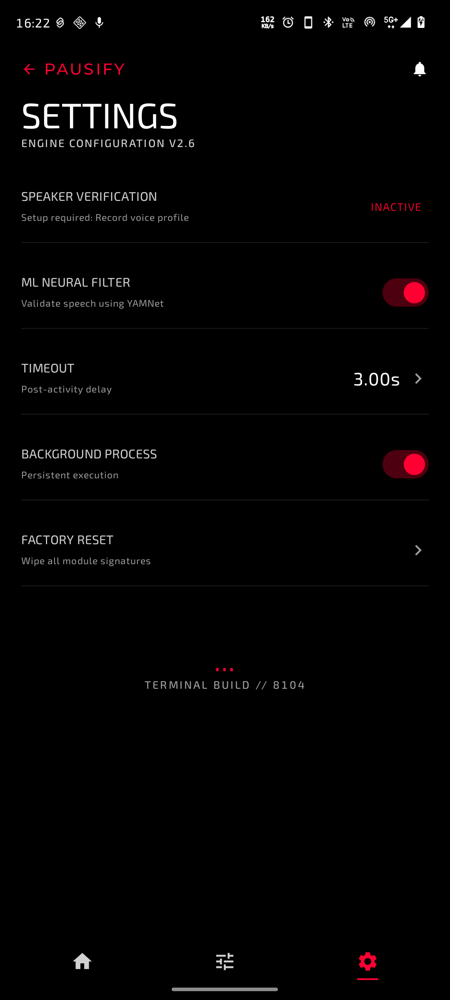
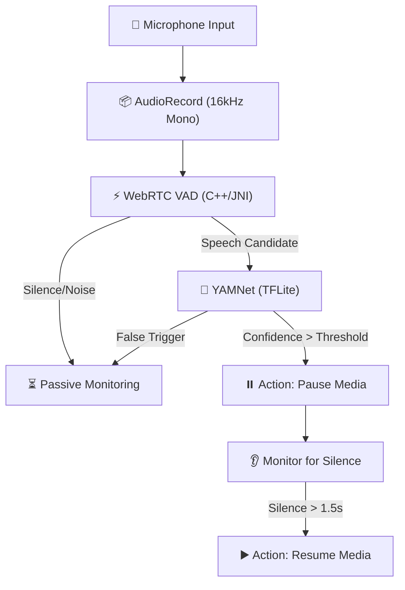

# Pausify

**Pausify** is a real-time, on-device speech intelligence engine designed to enhance media consumption by automatically pausing playback when the user speaks and resuming it when they stop. 

Built for Android, Pausify addresses the friction of manual media control in hands-busy or multitasking scenarios (e.g., cooking, driving, or working). It leverages edge AI to process audio locally, ensuring ultra-low latency and absolute privacy.

---

## 🚀 Key Features

- **Real-Time Speech Detection**: Employs a low-latency Voice Activity Detection (VAD) layer to detect speech onset within 100–200ms.
- **ML-Based Speech Validation**: Validates detected audio using a lightweight TensorFlow Lite model (YAMNet) to distinguish actual speech from background noise, coughs, or sneezes.
- **Intelligent Playback Control**: Automatically requests and releases audio focus to pause and resume media smoothly without rapid toggling (debounce logic).
- **Persistent Foreground Service**: Operates reliably in the background with a persistent notification, surviving aggressive OS background restrictions.
- **Privacy by Design**: All audio processing and machine learning inference happen entirely on-device. No audio data is ever stored or transmitted.

---

## 📱 Screenshots

| Screenshot 1 | Screenshot 2 | Screenshot 3 |
| :---: | :---: | :---: |
|  |  |  |

---

## ⚙️ How It Works

Pausify uses a multi-stage pipeline to balance low latency with high precision:

1. **Audio Capture**: Captures 16kHz mono audio via the `AudioRecord` API in small chunks (10–30ms).
2. **VAD Layer**: A highly optimized WebRTC VAD (compiled via JNI) quickly filters out silence and low-energy noise.
3. **ML Validation**: If speech is candidate, the system runs a TFLite inference to confirm the audio is indeed human speech.
4. **Action Engine**: Upon valid speech detection persisting for a threshold (e.g., 300ms), the engine triggers a media pause. Playback resumes after a configurable silence duration (e.g., 1.5s).

### Architecture Pipeline



---

## 🛠️ Tech Stack

- **Platform**: Android Native (SDK 34+)
- **Language**: Kotlin
- **UI Framework**: Jetpack Compose (Dashboard)
- **Audio APIs**: `AudioRecord`, `AudioManager` (Audio Focus)
- **ML & DSP**: WebRTC VAD, TensorFlow Lite (YAMNet)
- **Concurrency**: Kotlin Coroutines & StateFlow

---

## 📂 Project Structure

```text
├── app/
│   ├── src/
│   │   ├── main/
│   │   │   ├── cpp/             # WebRTC VAD JNI implementation
│   │   │   ├── java/            # Kotlin source code (UI, Service, ML)
│   │   │   ├── assets/          # TFLite models
│   │   │   └── AndroidManifest.xml
│   └── build.gradle.kts
├── build.gradle.kts
└── settings.gradle.kts
```

---

## 🎛️ Key Configuration

The detection engine behavior is controlled by several key parameters (configurable in the source):

| Parameter | Default Value | Description |
| :--- | :--- | :--- |
| `AUDIO_SAMPLE_RATE` | `16000` | Sample rate in Hz for audio capture. |
| `AUDIO_CHUNK_SIZE` | `20ms` | Frame size for real-time processing. |
| `VAD_AGGRESSIVENESS` | `2` | WebRTC VAD mode (0-3, higher is more aggressive). |
| `ML_CONFIDENCE_THRESHOLD` | `0.7` | Minimum confidence score for YAMNet speech classification. |
| `SPEECH_DURATION_THRESHOLD` | `300ms` | Continuous speech required to trigger pause. |
| `SILENCE_DURATION_THRESHOLD` | `1200ms` | Silence required to trigger resume. |

---

## 📦 Installation & Setup

To build and run Pausify locally, you will need **Android Studio** (Ladybug or newer recommended).

1. **Clone the Repository**:
   ```bash
   git clone https://github.com/RohitKSahoo/Pausify.git
   ```
2. **Open the Project**:
   - Launch Android Studio.
   - Select **Open** and navigate to the cloned `Pausify` directory.
3. **Build and Run**:
   - Connect a physical Android device (recommended for accurate microphone and audio focus testing).
   - Click the **Run** icon in Android Studio.

---

## 🔬 Engineering Highlights

- **Latency-First Design**: Achieving a speech-to-pause latency of `<300ms` required careful tuning of buffer sizes and asynchronous processing using Kotlin Coroutines.
- **Battery Optimization**: Continuous ML inference would drain the battery rapidly. Pausify mitigates this by using the lightweight VAD as a gatekeeper, running the heavier TFLite model only when necessary.
- **Native JNI Integration**: WebRTC VAD is compiled from C++ via JNI to ensure maximum performance and minimum footprint on the mobile CPU.

---

## 🗺️ Roadmap

- [ ] **Speaker Verification**: Integrate a speaker recognition model (e.g., ONNX-based) to ensure media only pauses when the *device owner* speaks.
- [ ] **Adaptive Thresholding**: Dynamically adjust VAD and ML sensitivity based on environmental ambient noise levels.
- [ ] **Customizable Controls**: Expose sensitivity and duration thresholds in the UI for user customization.

---

## 📄 License

This project is licensed under the MIT License - see the [LICENSE](LICENSE) file for details.